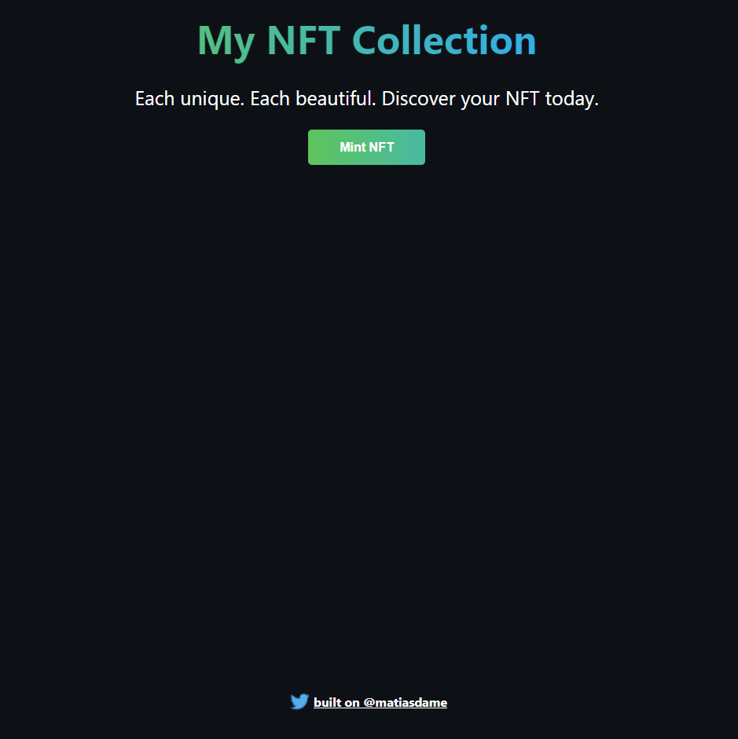

# My Epic NFT

Buildspace - Mint your own NFT

## Environment Variables

To run this project, you will need to add the following environment variables to your .env file

`STAGING_ALCHEMY_KEY`

`PRIVATE_KEY`

`ETHERSCAN_KEY`

## Usage

To deploy

```
npx hardhat run scripts/deploy.js --network rinkeby
```

To verify contract

```
npx hardhat verify CONTRACT_ADDRESS --network rinkeby
```

## Dapp

URL Frontend dapp

```
https://nft-starter-project.matiasdamelio.repl.co/
```


